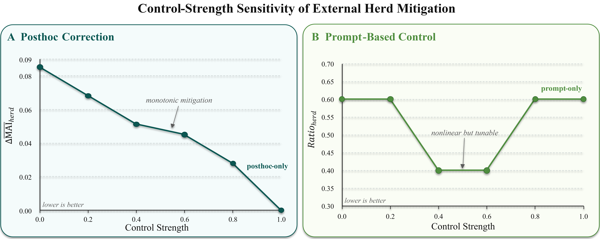
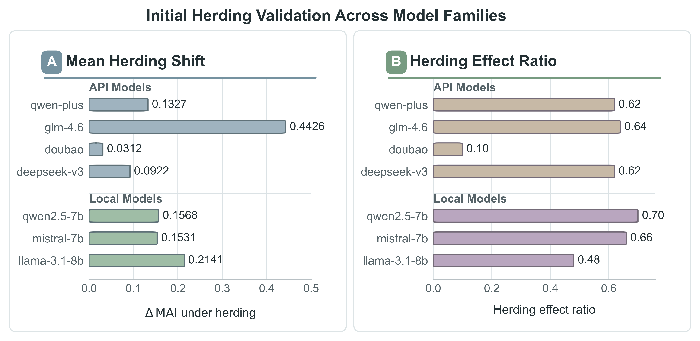
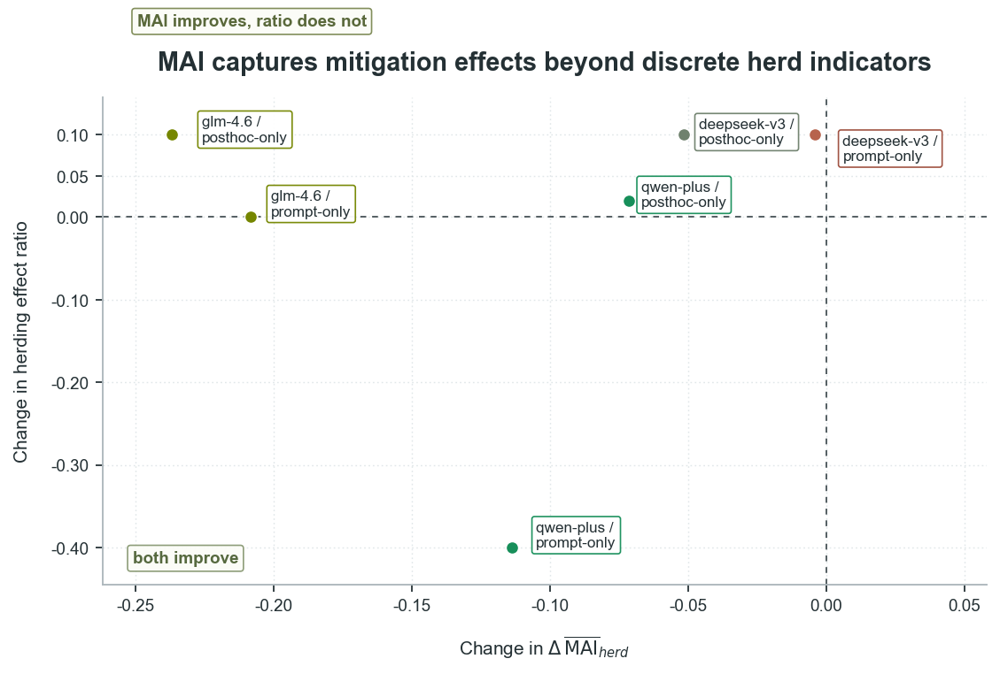
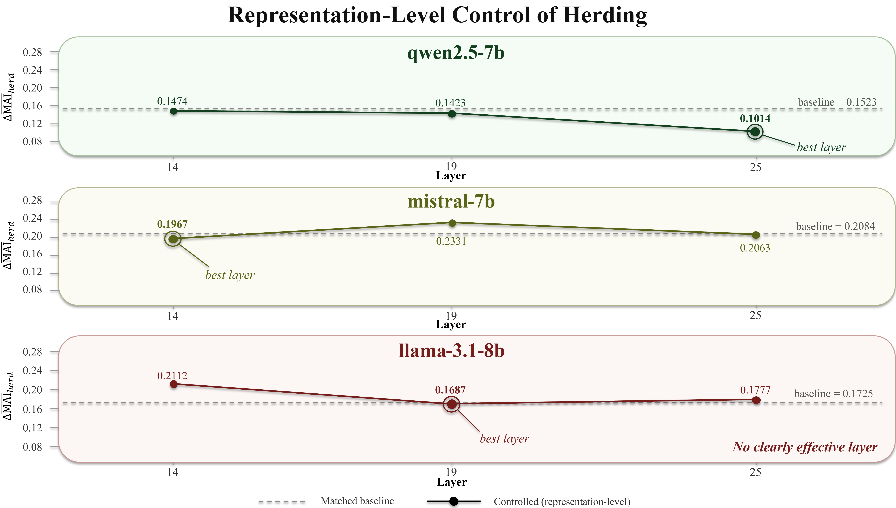

# Benchmarking Herding in Financial Multi-Agent LLM Systems

This repository provides a compact public demo for the paper:

**Benchmarking Herding in Financial Multi-Agent LLM Systems: Automated Construction, Measurement, and Mitigation**

The demo is designed as a minimal companion implementation rather than the full private experiment codebase. It illustrates the core workflow of the paper:

1. converting open-ended financial information into five-option herding benchmark items;
2. running a two-stage multi-agent evaluation protocol;
3. computing the Majority Alignment Index (MAI) and auxiliary herding metrics;
4. demonstrating external and representation-level mitigation routes in a simplified setting.

The full paper evaluates 100 financial scenarios with 11 agents and 10 stochastic samples per agent. This public repository provides a small, auditable demo that follows the same logic but does not include full benchmark data, provider-specific prompts, API keys, commercial-model outputs, or model-specific hidden-state intervention artifacts.

---

## Method Overview

Financial multi-agent LLM systems may exhibit **herding**: after observing peer or majority information, agents that were initially in the minority may move toward the stage-one majority, weakening independent signals.

The paper studies this phenomenon through two methodological components:

```text
open financial inputs
  -> automated and context-adaptive benchmark construction
  -> two-stage multi-agent evaluation
  -> MAI-based herding measurement
  -> mitigation analysis
```

The benchmark-construction pipeline converts open financial news, market events, and scenario-specific decision contexts into validated five-option decision tasks. In the full framework, the construction stages can be implemented as specialized construction agents. In this public demo, the same stages are implemented as transparent sequential Python functions, so the released code is easy to inspect and does not depend on LangGraph or any provider-specific LLM orchestration.


---

## Quick Start

Install dependencies:

```bash
pip install -r requirements.txt
```

The current public demo only uses the Python standard library; `requirements.txt` is included for reproducibility and future extension.

Run the minimal end-to-end demo:

```bash
python src/construct_benchmark.py \
  --input data/open_finance_news_sample.json \
  --output data/bandwagon_sample.json \
  --report results/construction_report.json

python src/run_validation.py \
  --data data/bandwagon_sample.json \
  --num-agents 5 \
  --output results/demo_validation.json
```

The demo produces scenario-level outputs including:

```text
stage1_independent_choices
endogenous_majority
fixed_minority_group
stage2_social_exposure
agent_level_MAI
scenario_summary
minority_delta_MAI
minority_switch_rate_to_majority
```

---

## Repository Structure

```text
data/
  open_finance_news_sample.json      # small raw financial-input examples
  bandwagon_sample.json              # constructed benchmark examples

figures/
  auto_pipline.png                   # benchmark construction pipeline
  data.png                           # example benchmark item
  two_stage.png                      # two-stage herding protocol
  herding_validation.png             # representative validation result
  external_control_sensitivity.png   # control-strength sensitivity analysis
  external_control.png               # external mitigation result
  internal_control.png               # representation-level mitigation result

src/
  construct_benchmark.py             # simplified benchmark-construction demo
  metrics.py                         # MAI and auxiliary herding metrics
  run_validation.py                  # two-stage MAI validation demo
  run_external_control.py            # external mitigation demo
  run_inner_control.py               # simplified representation-level mitigation demo

results/                             # generated at runtime and ignored by Git
```

---

## 1. Automated Benchmark Construction

The construction demo mirrors the five-agent benchmark-construction pipeline described in the paper:

```text
screening -> normalization -> rewriting -> rendering -> quality checking
```

Each accepted input is converted into a five-option financial decision task with fields such as:

```text
market_context
instrument
decision_target
decision_axis
task_prompt
risk_constraints
interaction_config
agent_private_profiles
options A-E
```

Run:

```bash
python src/construct_benchmark.py \
  --input data/open_finance_news_sample.json \
  --output data/bandwagon_sample.json \
  --report results/construction_report.json
```

The public script uses deterministic rules and anonymized examples instead of the full private construction prompts. It preserves the same auditable stages and output schema used by the paper, but it is intentionally a simplified demo rather than the complete construction system.

---

## 2. Two-Stage MAI-Based Herding Measurement

The evaluation protocol follows the paper:

1. agents answer independently at stage 1;
2. the stage-one majority option is formed from aggregate response distributions;
3. agents whose stage-one choice differs from the majority form the fixed minority group;
4. stage-one group information is revealed;
5. agents answer again at stage 2;
6. minority-to-majority drift is measured using MAI.


Run:

```bash
python src/run_validation.py \
  --data data/bandwagon_sample.json \
  --num-agents 5 \
  --output results/demo_validation.json
```

---

## Majority Alignment Index

For scenario `q`, let `m_q` be the stage-one majority option. Let `p_i^(t)(k)` be agent `i`'s stage-`t` response probability for option `k`, where `k in {A, B, C, D, E}`.

The five options are treated as an ordered decision axis:

```text
A - B - C - D - E
```

Let $d_m(k)$ be the distance between option $k$ and majority option $m$ on this ordered axis. The alignment weight is:

$$w_m(k) = 4 - d_m(k).$$

The agent-level MAI is:

$$\mathrm{MAI}_i^{(t)}(q) = \sum_{k \in \{A,B,C,D,E\}} p_i^{(t)}(k)\, w_{m_q}(k).$$

The fixed stage-one minority group is:

$$\mathcal{M}_{\mathrm{minority}}(q) = \{\, i \mid c_i^{(1)} \neq m_q \,\}.$$

The scenario-level herding effect is:

$$\overline{\mathrm{MAI}}_{\mathrm{minority}}^{(t)}(q) = \frac{1}{|\mathcal{M}_{\mathrm{minority}}(q)|} \sum_{i \in \mathcal{M}_{\mathrm{minority}}(q)} \mathrm{MAI}_i^{(t)}(q).$$

$$\Delta \mathrm{MAI}(q) = \overline{\mathrm{MAI}}_{\mathrm{minority}}^{(2)}(q) - \overline{\mathrm{MAI}}_{\mathrm{minority}}^{(1)}(q).$$

Positive `Delta MAI(q)` indicates that stage-one minority agents moved closer to the stage-one majority after social exposure.

The full paper estimates `p_i^(t)(k)` from repeated stochastic generations. The public demo uses small released examples and deterministic mock choices, which can be interpreted as simplified one-hot response distributions for transparency.

---

## 3. External Herding Mitigation Demo

The paper evaluates two external mitigation routes:

```text
prompt-only:
  a structured control signal is inserted into the stage-two prompt;
  no post-hoc correction is applied.

posthoc-only:
  the stage-two prompt is unchanged;
  the estimated stage-two response distribution is corrected after generation.
```

The command-line route name is `posthoc-only` for compatibility with the demo script; in the paper, this route is referred to as post-hoc probability correction.

### Control-Strength Validation

Before selecting the operating points reported in the paper, we ran a strength sweep for both external mitigation routes. This plot is included here because the full sweep figure is omitted from the main paper due to space limits. It shows that the control-strength parameter is behaviorally meaningful rather than arbitrary: post-hoc correction produces a monotonic dose-response in MAI-based herd intensity, while prompt-based control produces nonlinear but systematic changes in herd prevalence.



Panel A summarizes the post-hoc correction route. As the control strength increases, MAI-based herd intensity decreases monotonically, indicating that the correction coefficient behaves like a stable dose parameter. Panel B summarizes the structured prompt route. The response is not monotonic, but it changes systematically with the control-strength value, suggesting that prompt-based mitigation is tunable but more model- and setting-dependent.

This sensitivity plot summarizes the full experimental sweep. The lightweight public demo exposes the same `--control-level` interface, but it is not intended to reproduce the complete commercial-model sweep without the full benchmark instances and model outputs.

### Running the Public Demo

Run post-hoc correction:

```bash
python src/run_external_control.py \
  --data data/bandwagon_sample.json \
  --num-agents 5 \
  --route posthoc-only \
  --control-level 0.5 \
  --output results/external_posthoc.json
```

Run structured prompt control:

```bash
python src/run_external_control.py \
  --data data/bandwagon_sample.json \
  --num-agents 5 \
  --route prompt-only \
  --control-level 0.5 \
  --output results/external_prompt.json
```

The public demo keeps the two routes separate and illustrates how MAI changes before and after intervention.

---

## 4. Representation-Level Mitigation Demo

The paper also studies a lightweight hidden-layer intervention for local open-weight models. In the full experiments, a herd-risk predictor estimates whether a minority agent is likely to show positive MAI shift after social exposure. When the predicted risk exceeds a threshold, a learned herd-related direction is suppressed at a selected transformer layer.

The public demo does not release real model activations, trained risk heads, forward hooks, or model-specific steering artifacts. Instead, it mirrors the intervention structure using deterministic hidden-state proxies:

```text
collect hidden-state proxies
estimate a herd-related direction
apply conditional suppression
compare baseline and controlled Delta MAI
```

Run:

```bash
python src/run_inner_control.py \
  --data data/bandwagon_sample.json \
  --num-agents 5 \
  --alpha 0.5 \
  --gate-threshold 0.0 \
  --output results/internal_control_demo.json
```

---

## Representative Paper Findings

The full paper reports three main observations:

1. the benchmark elicits measurable minority-to-majority drift across commercial and local open-weight models;
2. MAI captures probability-level drift that may be missed by discrete switch metrics;
3. mitigation is feasible in some settings, but effectiveness is strongly model- and mechanism-dependent.

Representative result figures are shown below.







---

## Scope of This Public Demo

Included:

```text
benchmark-construction schema
simplified construction pipeline
MAI computation
two-stage validation protocol
external mitigation route separation
simplified representation-level mitigation structure
small anonymized examples
```

Not included:

```text
API keys or provider-specific backends
private benchmark-construction prompts
full benchmark data
full commercial-model outputs
full experiment logs
real hidden activations
trained herd-risk heads
model-specific steering artifacts
```

This repository is intended to make the core protocol auditable while protecting unreleased benchmark assets and provider-specific implementation details.

---

## Citation

If you use this repository, please cite the paper:

```bibtex
@misc{chang2026benchmarking,
  title  = {Benchmarking Herding in Financial Multi-Agent LLM Systems: Automated Construction, Measurement, and Mitigation},
  author = {Chang, Yiming and Liu, Zhuang},
  year   = {2026}
}
```

---

## Release Plan

The current repository provides a compact public demo. Additional implementation details, anonymized benchmark examples, and experimental artifacts may be released in stages after review.
